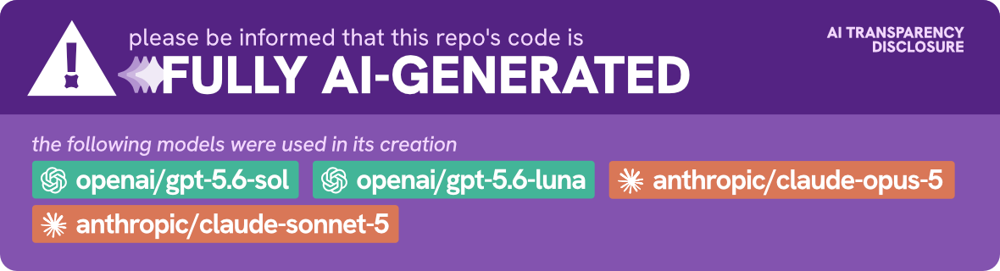

# DryCut

DryCut is a private, local desktop app for removing image backgrounds on Windows, macOS, and Linux. Drop in one photo or a batch, review the transparent results, then copy or save them as PNGs.

## Highlights

- **Fast by default:** an included, quantized IS-Net model handles everyday images offline.
- **Stronger when needed:** download the optional BiRefNet model in Settings for hair, fur, and busy backgrounds.
- **Adjustable edges:** choose None, Soft, Balanced, or Detailed edge cleanup and reprocess without reopening the image.
- **Flexible output:** copy transparent PNG data to the clipboard, save to `Pictures\DryCut`, save beside the original, or choose a location each time.
- **Batch-friendly:** queue several images, see an estimated time remaining, and keep working through results in the built-in gallery.
- **Easy reuse:** copy or delete any gallery result with one click. DryCut remembers processed images across restarts for 30 days; save anything you want to keep permanently.
- **Desktop-friendly:** drag and drop, paste an image straight from the clipboard with Ctrl+V (Cmd+V on macOS), native file pickers, keyboard shortcuts, and single-instance file forwarding on supported platforms, plus optional Explorer image context-menu integration on Windows.
- **Panel mode:** shrink the window to a narrow side panel you can park beside another app, with an always-on-top pin so it stays visible while you work.
- **Fully offline:** every part of the app runs on your PC. The only network request DryCut ever makes is the optional, user-initiated download of the stronger model.

## Install on Windows

For most people, run:

```text
DryCut-Setup-1.0.0.exe
```

The installer is per-user and does not require administrator access. The included default model works offline after installation. Because this build is not code-signed, Windows SmartScreen may show an unrecognized-app warning.

A portable ZIP is also available. Extract it completely, then run `DryCut.Desktop.exe`. Do not run the executable from inside the ZIP.

## Use

1. Open, drop, or paste (Ctrl+V / Cmd+V) one or several PNG, JPEG, WebP, BMP, or TIFF images.
2. DryCut processes the queue in order and shows its estimated remaining time after learning from the first completed image.
3. Select any processed result in the queue/gallery to preview, copy, save, or delete it.
4. If needed, choose a stronger model or a different edge preset, then select **Reprocess** to redo the selected image without re-importing it.
5. Use **Save** or **Save as…** for anything you want to keep beyond the 30-day gallery period.
6. Switch to panel mode from the header to work in a narrow window beside another app; pin it on top so it stays visible.

The original image is never modified.

See `docs/USER_GUIDE.txt` for keyboard shortcuts, settings, Explorer integration, troubleshooting, and privacy details.

## Build from source

Requirements:

- .NET 8 SDK

The application and test suite build on Windows, macOS, and Linux:

```text
dotnet test DryCut.sln
dotnet publish src/DryCut.Desktop/DryCut.Desktop.csproj -c Release -r <runtime-id> --self-contained false
```

Use `win-x64`, `osx-x64`, `osx-arm64`, `linux-x64`, or another .NET 8 runtime identifier as appropriate. DirectML acceleration and Explorer integration are Windows-only; other platforms use ONNX Runtime's CPU provider. The repository currently produces an installer only for Windows.

Building that Windows installer additionally requires Windows 10 19041 or later (or Windows 11), PowerShell 5.1+, and Inno Setup 6:

```powershell
./scripts/build-release.ps1 -Version 1.0.0
```

The script restores, tests, publishes a self-contained `win-x64` build, downloads and SHA-256 verifies the default model, and creates:

- `artifacts/DryCut-Setup-1.0.0.exe`
- `artifacts/DryCut-portable-1.0.0.zip`

For a reproducible build using an already verified model:

```powershell
./scripts/build-release.ps1 -Version 1.0.0 -DefaultModelPath C:\path\to\isnet-general-use-q8.onnx
```

Architecture and implementation decisions are in `docs/ARCHITECTURE.md` and `docs/IMPLEMENTATION.md`.

## Models and licenses

- IS-Net general-use q8 is an Apache-2.0 licensed quantized ONNX redistribution from `SacredNoir/isnet-general-use-onnx`.
- BiRefNet ONNX is distributed by `onnx-community/BiRefNet-ONNX` under MIT metadata and is downloaded only when requested.
- Runtime dependency notices are generated into `THIRD-PARTY-NOTICES.txt` during release packaging.

DryCut's source is MIT licensed. See `LICENSE`.
